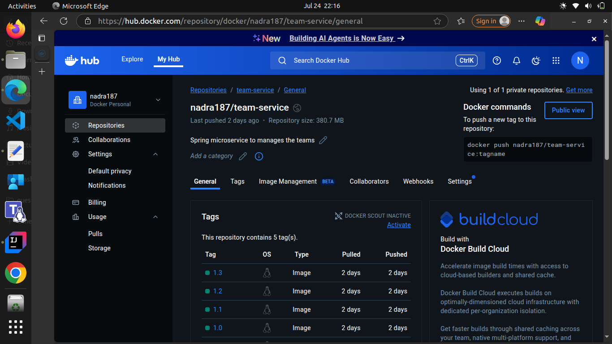
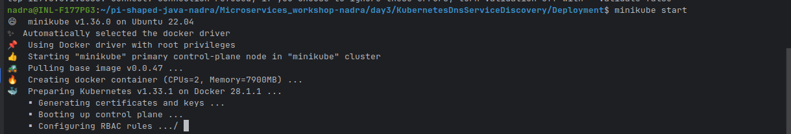
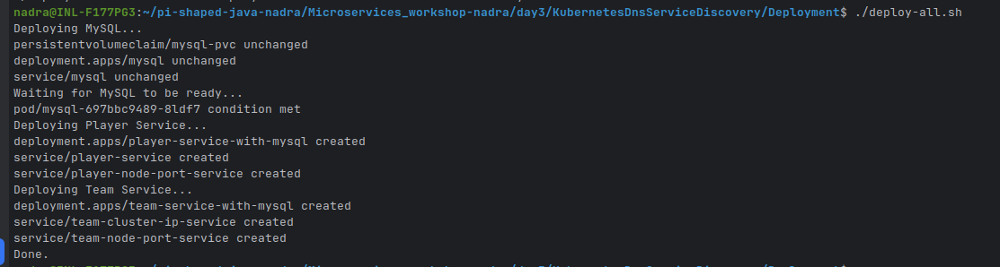
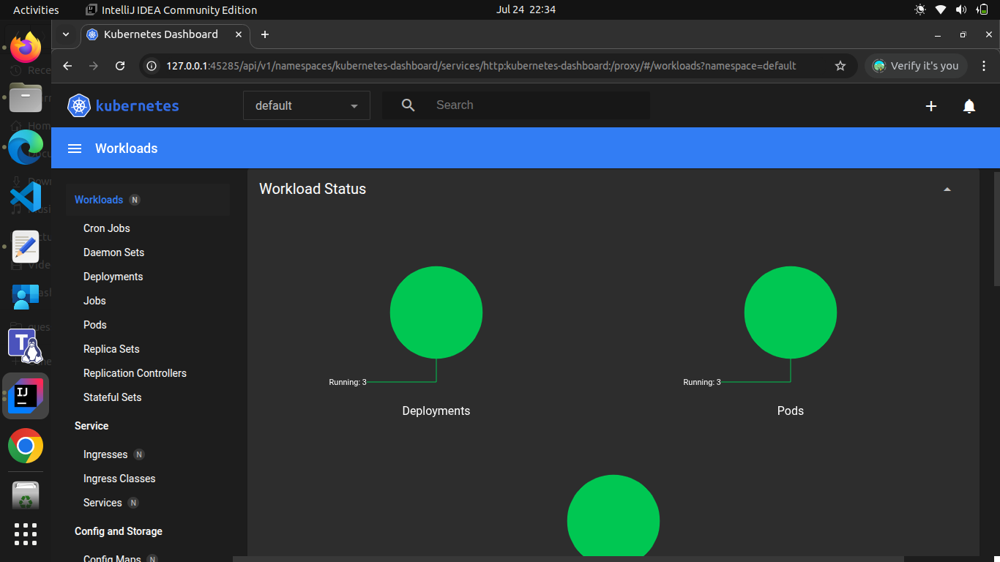
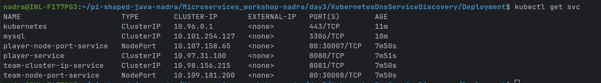
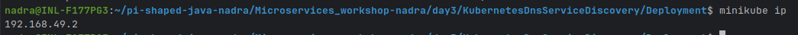
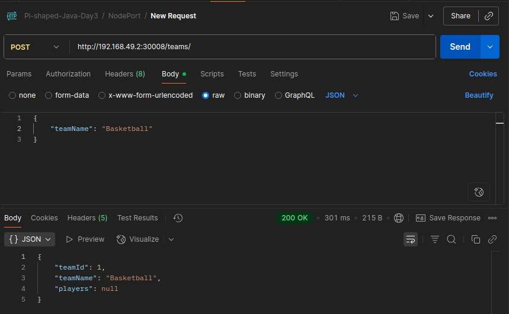
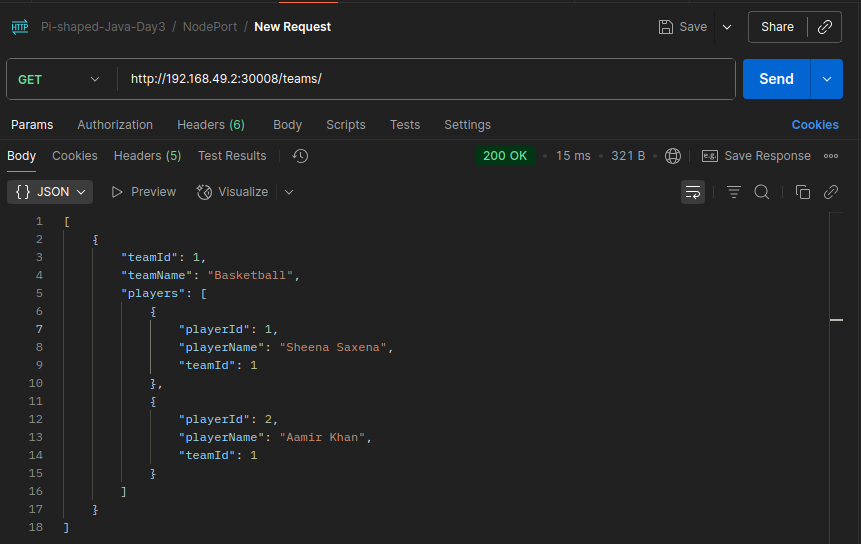

# Kubernetes Deployment of Spring Boot Microservices
This project demonstrates the deployment of two Spring Boot microservices, `player-service` and `team-service`, using Docker and Kubernetes. The services are designed to interact with each other, with `team-service` making REST calls to `player-service`. The project includes the creation of Dockerfiles for each service, Kubernetes deployment files, and a script to automate the deployment process.Tested the services using Postman:
   - Tested the `player-service` by sending GET requests to retrieve player information.
   - Tested the `team-service` by sending GET requests to retrieve team information, which includes calls to the `player-service` to fetch player details.

---

## Task 1. Create two Spring Boot services: player-service and team-service
1. Created the folder `Microservices` to hold the microservices project and their respective dockerfiles.
2. Created the microservice: `player-service` with the following dependencies:
    - Spring Boot Starter Web
    - Spring Boot Starter JPA
    - MySQL Driver
    - Lombok
3. Created the microservice: `team-service` with the following dependencies:
    - Spring Boot Starter Web
    - Spring Boot Starter JPA
    - MySQL Driver
    - Lombok
    - OpenFeign: As the `team-service` will call the `player-service`, it needs to have OpenFeign dependency to make REST calls to other services.

---

## Task 2. Create a Dockerfile for each service
1. Created a `Dockerfile` for `player-service` in the Microservices/player-service directory and pushed it to the repository.
   
2. Created a `Dockerfile` for `team-service` in the Microservices/team-service directory and pushed it to the repository.
   

---

## Task 3. Set up deployment for each service in Kubernetes
1. Created the folder `Deployment` to hold the deployment files for each service.
2. Inside the `Deployment` folder, created subfolders for each service:
   - `player-service-deployment`
   - `team-service-deployment`
   - `mysql-deployment`: Both the `player-service` and `team-service` will use MySQL as their database, so a separate deployment for MySQL is created.
3. In the `mysql-deployment`, created:
    - `mysql-deployment.yaml`: Deployment file for MySQL service.
    - `mysql-pvc.yaml`: Persistent Volume Claim for MySQL, to ensure data persistence.
    - `mysql-cluster-ip-service.yaml`: Cluster IP Service file for MySQL, to expose it within the Kubernetes cluster.
4. In the `player-service-deployment`, created:
    - `player-service-deployment.yaml`: Deployment file for the player service.
    - `player-cluster-ip-service.yaml`: Cluster IP Service file for player service, to expose it within the Kubernetes cluster.
    - `player-node-port-service.yaml`: NodePort Service file for player service, to expose it outside the cluster.
5. In the `team-service-deployment`, created:
    - `team-service-deployment.yaml`: Deployment file for the team service.
    - `team-cluster-ip-service.yaml`: Cluster IP Service file for team service, to expose it within the Kubernetes cluster.
    - `team-node-port-service.yaml`: NodePort Service file for team service, to expose it outside the cluster.

---

## Task 4. Create a Kubernetes cluster and deploy the services
1. Created a Kubernetes cluster using Minikube.
   
2. Created a shell script `deploy.sh` to automate the deployment of the services in the Kubernetes cluster.
3. Executed the `deploy.sh` script to deploy the services in the Kubernetes cluster.
   

---

## Task 5. Test the services
1. Checked the status of the pods through the command:
   ```bash
   minikube dashboard
   ```
   
2. Checked the service status:
   
3. Get the cluster IP :
   
4. Created the teams and players using Postman, by sending POST requests through the NodePort services.
   
5. Tested the `team-service` by sending GET requests to retrieve team information, which includes calls to the `player-service` to fetch player details.
   

---